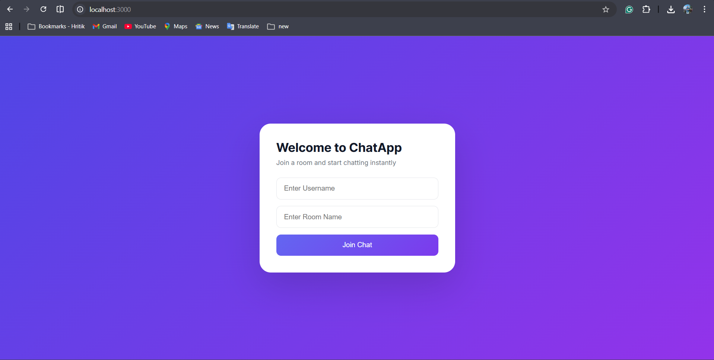
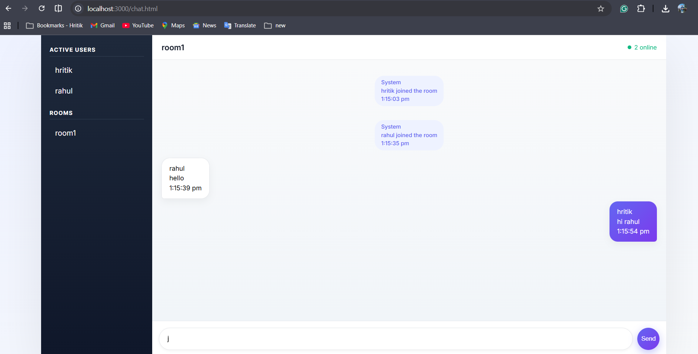
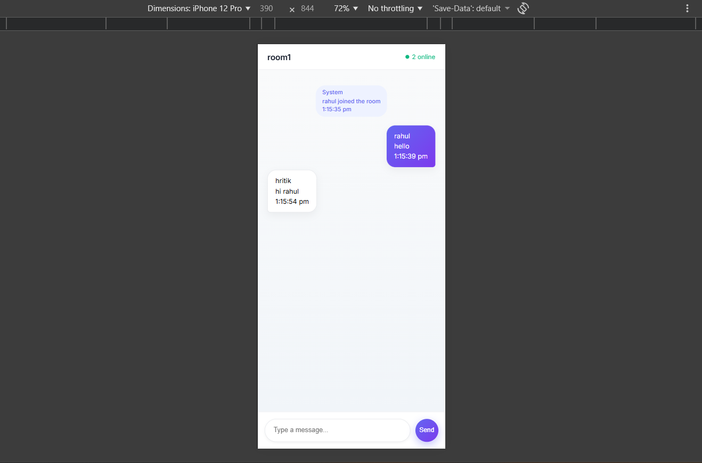

# 💬 Real-Time Chat Application

A modern, fully responsive real-time chat application built using
**Node.js, Express, and Socket.io**.\
This project enables users to communicate instantly within multiple chat
rooms and switch rooms dynamically without refreshing the page.

------------------------------------------------------------------------

## 📌 Project Overview

The Real-Time Chat Application allows users to:

-   Join chat rooms using a username
-   Send and receive real-time messages
-   Switch rooms dynamically
-   View active users in each room
-   See system notifications (join/leave/disconnect)
-   Use the application on mobile, tablet, and desktop devices

------------------------------------------------------------------------

## 🚀 Features

### 🔹 Core Features

-   Real-time messaging using Socket.io
-   Multi-room support
-   Dynamic room switching
-   Online users tracking
-   System notifications
-   Auto-scroll to latest message

### 🔹 UI/UX Features

-   Modern SaaS-style interface
-   Mobile-first responsive design
-   Smooth animations
-   Clean message bubble layout
-   Live online indicator

### 🔹 Technical Features

-   Socket.io room management
-   User join & leave tracking
-   Disconnect handling
-   Dynamic DOM updates
-   Organized folder structure

------------------------------------------------------------------------

## 🛠️ Tech Stack

### Frontend

-   HTML5
-   CSS3 (Responsive Design)
-   JavaScript (ES6)

### Backend

-   Node.js
-   Express.js

### Real-Time Communication

-   Socket.io

------------------------------------------------------------------------

## 📂 Project Structure

    chat-application/
    │
    ├── public/
    │   ├── index.html
    │   ├── chat.html
    │   ├── style.css
    │   └── script.js
    │
    ├── server.js
    ├── package.json
    └── README.md

------------------------------------------------------------------------

## ⚙️ Installation & Setup

### 1️⃣ Clone the Repository

``` bash
git clone https://github.com/yourusername/chat-application.git
cd chat-application
```

### 2️⃣ Install Dependencies

``` bash
npm install
```

### 3️⃣ Run the Server

``` bash
node server.js
```

### 4️⃣ Open in Browser

    http://localhost:3000

------------------------------------------------------------------------

## 📱 Responsive Design

The application supports:

-   📱 Mobile devices (320px+)
-   💻 Tablets (768px+)
-   🖥 Desktop screens (1024px+)

Mobile uses full-screen layout, while desktop uses centered layout with
shadow.

------------------------------------------------------------------------

## 🧠 How It Works

1.  Client connects to server using WebSocket.
2.  User emits `joinRoom` event with username and room name.
3.  Server assigns user to the specified room.
4.  Messages are broadcast to users in the same room using:

```{=html}
<!-- -->
```
    io.to(room).emit("message", messageData)

5.  On disconnect, user is removed from active users list.

------------------------------------------------------------------------

## 🧪 Test Cases Covered

-   Multiple users in same room
-   Users in different rooms
-   Room switching without refresh
-   User disconnect handling
-   Online user count updates
-   Responsive layout testing

------------------------------------------------------------------------

## 📸 Screenshots

> Create a folder named `screenshots` inside your project and add images
> there.

### 🟣 Join Page



### 🔵 Chat Page - Desktop View




### 📱 Chat Page - Mobile View



------------------------------------------------------------------------

## 🎯 Future Enhancements

-   Private messaging
-   Typing indicator
-   Dark mode
-   File sharing
-   Emoji support
-   Database integration (MongoDB)
-   Authentication system
-   Cloud deployment


------------------------------------------------------------------------

## 📜 License

This project is created for educational and internship purposes.
